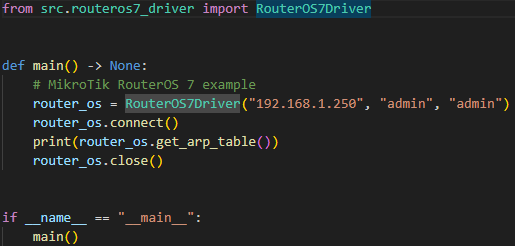
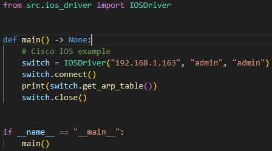

# NetOne

NetOne is a lightweight, cross-vendor network automation toolkit designed to collect essential operational data from network devices using a unified Python interface. The project abstracts vendor-specific differences, providing a consistent API to retrieve configuration, interface details, VLANs, MAC address tables, neighbors, and other network information.

The goal of NetOne is to simplify network monitoring and automation without requiring full-scale frameworks like Ansible or Nornir. Instead, it provides a clean, object-oriented Python API suitable for small-to-medium automation tasks and troubleshooting automation.

## Getting Started

Project was created with [UV](https://github.com/astral-sh/uv) which is fast Python package and project manager.


### Prerequisites

* uv
  ```sh
  pip install uv
  ```

### Instalation

1. Clone the repository

```sh
    git clone https://github.com/JanKulbaga/NetOne
```

2. Run the main.py with uv

```sh
    uv run main.py
```

## Usage

You can use one of the provided drivers by creating an instance and calling its methods after connecting to the device. The drivers implement a common protocol interface.

#### MikroTik RouterOS 7 example in main.py



```sh
uv run main.py
[ArpEntry(ip_address='192.168.1.31', mac_address='0C:9F:98:63:5A:C5'), ArpEntry(ip_address='192.168.1.100', mac_address='00:1F:9E:3E:EB:45')]   
```

#### Cisco IOS example in main.py



```sh
uv run main.py
[ArpEntry(ip_address='192.168.1.31', mac_address='0C:9F:98:63:5A:C5'), ArpEntry(ip_address='192.168.1.249', mac_address='DA:01:C5:CD:B7:13'), ArpEntry(ip_address='192.168.1.100', mac_address='00:1F:9E:3E:EB:45')]   
```

## License

Distributed under the Unlicense License. See [LICENSE](./LICENSE) for more information.